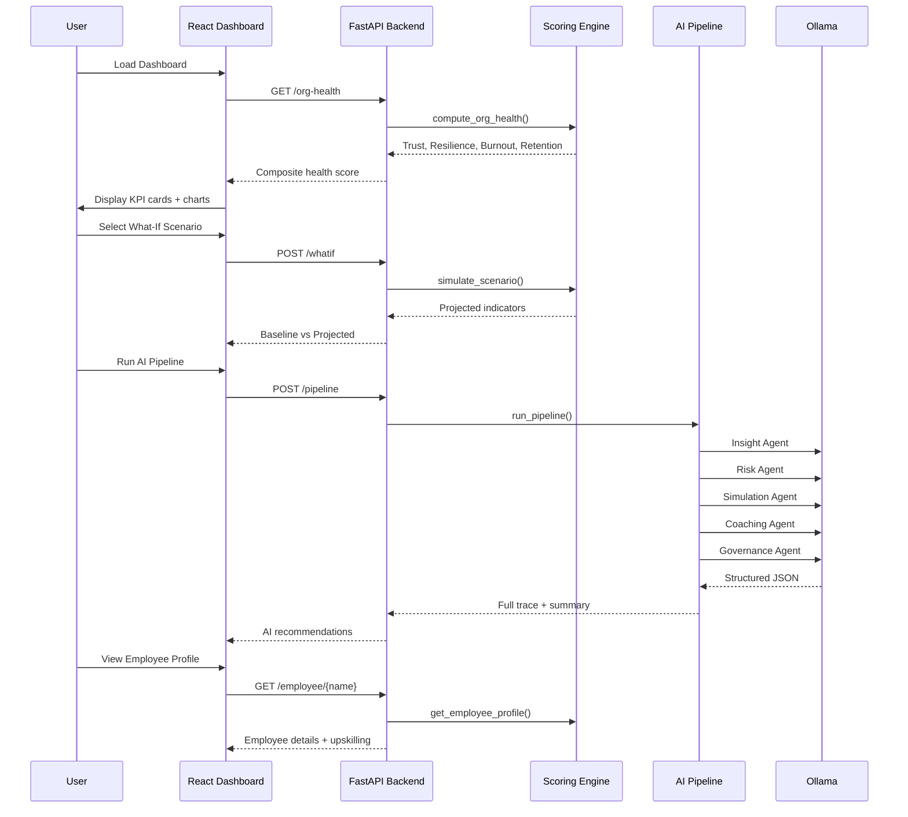

# TruPulse AI - Architecture

## System Overview

```mermaid
graph TB
    subgraph Frontend ["React Dashboard (:3000)"]
        UI[UI Components<br/>Tailwind CSS + Recharts]
        PAGES[Pages<br/>Dashboard / Employees / What-If / SPOF<br/>Skill Gaps / Succession / Readiness / Report]
        API_CLIENT[API Client Layer<br/>fetch() / services/api.js]
    end

    subgraph Backend ["FastAPI Server (:8000)"]
        API[FastAPI Routes<br/>main.py]
        SCORING[Scoring Engine<br/>scoring.py]
        ANALYTICS[Enhanced Analytics<br/>analytics_enhanced.py]
        AGENTS[5-Agent Pipeline<br/>agents.py]
        STORAGE[Data Layer<br/>storage.py + CSVs]
        CLASSIFIER[File Classifier<br/>file_classifier.py]
    end

    subgraph AI ["AI Layer"]
        OLLAMA[Ollama<br/>qwen2.5:3b]
        INSIGHT[Insight Agent]
        RISK[Risk Agent]
        SIM[Simulation Agent]
        COACH[Coaching Agent]
        GOV[Governance Agent]
    end

    subgraph Data ["Data Layer"]
        EMP[employees.csv]
        PROJ[projects.csv]
        DEP[dependencies.csv]
        KNOW[knowledge.csv]
        PERF[performance.csv]
        WORK[workload.csv]
        NOTES[review_notes.txt]
    end

    UI --> PAGES
    PAGES --> API_CLIENT
    API_CLIENT -->|HTTP| API
    API --> SCORING
    API --> ANALYTICS
    API --> AGENTS
    API --> STORAGE
    API --> CLASSIFIER
    STORAGE --> Data
    AGENTS --> OLLAMA
    OLLAMA --> INSIGHT
    OLLAMA --> RISK
    OLLAMA --> SIM
    OLLAMA --> COACH
    OLLAMA --> GOV
```

## Data Flow



## API Endpoints

| Method | Endpoint | Description |
|--------|----------|-------------|
| GET | `/` | Health check + endpoint list |
| GET | `/org-health` | 4-indicator org health composite |
| GET | `/employee/{name}` | Full employee profile |
| GET | `/employee-data/{id}` | Employee data by ID |
| POST | `/analyze-employee/{id}` | AI analysis per employee |
| POST | `/whatif` | Scenario simulation |
| POST | `/pipeline` | 5-agent AI pipeline |
| POST | `/feedback` | Human-in-the-loop override |
| GET | `/feedback` | List past overrides |
| GET | `/report` | Downloadable HTML report |
| GET | `/skill-gaps` | Team-level skill gap analysis |
| GET | `/succession-planning` | Backfill readiness per role |
| GET | `/workforce-readiness` | Project pipeline readiness |
| GET | `/knowledge-concentration` | Knowledge bus-factor risk |
| GET | `/spof-ranking` | Ranked single points of failure |
| GET | `/upskilling/{name}` | Personalized learning paths |
| POST | `/upload-file` | Upload CSV/TXT/XLSX workforce data |
| GET | `/files` | List uploaded files |
| POST | `/text-input` | Parse employee data from text |
| GET | `/text-input/list` | Recent text inputs |
| POST | `/feedback/suggestions` | Generate AI suggestions for review |
| POST | `/feedback/apply` | Apply human decisions + recalculate |
| POST | `/scenario-run` | Scenario with reaction type (pipeline/human/agent) |
| GET | `/reactions` | Available reaction types |
| POST | `/query` | Natural language multi-scenario query |
| GET | `/scenarios` | 20+ multi-scenario permutations catalog |
| GET | `/demo-data` | Pre-cached demo payload |
| POST | `/dataset/upload` | Upload + auto-activate dataset |
| POST | `/dataset/activate` | Activate specific dataset with column mapping |
| GET | `/dataset/info` | Current dataset status |
| GET | `/dataset/files` | List all uploaded datasets |
| POST | `/dataset/clear` | Reset to default CSVs |
| POST | `/dataset/preview` | Preview file + suggested column mapping |
| GET | `/dataset/employee-data/{name}` | Employee from active dataset |
| GET | `/dataset/employees` | List all employees |

## Innovation Differentiators (for Judges)

| # | Differentiator | What It Means | Where It Lives |
|---|---------------|---------------|----------------|
| 1 | 🔮 **Predictive Simulation** | "We don't just report current state — we predict future state" | `POST /whatif` + TimeMachine UI |
| 2 | 🧠 **Collective Agent Intelligence** | "5 specialized agents collaborate, not 1 generalist" | Pipeline trace in WhatIf page — each agent's output visible |
| 3 | 👥 **Human-in-the-Loop by Design** | "Every recommendation is reviewable, overridable, and improves over time" | FeedbackModal on each coaching action + `POST /feedback` |
| 4 | 🛡️ **Governance-First AI** | "Every output comes with confidence, reasoning, and counter-argument" | GovernancePanel with bias check, reasoning trace, confidence gauge |
| 5 | 🔒 **Privacy-Preserving** | "Local LLM via Ollama — your data never leaves your infrastructure" | Entire stack runs on localhost, no external API calls |
| 6 | ⚡ **Zero-to-Insight** | "Upload CSV → see org health — no configuration needed" | `POST /upload-file` → Dashboard refresh |

## Key Design Decisions

1. **CSV as data store** — Zero setup. Swap to PostgreSQL via one env var.
2. **Deterministic scoring** — All 4 indicators use interpretable formulas. `# production: replace with XGBoost` comment in scoring.py.
3. **AI fallback** — If Ollama is down, deterministic templates ensure demo never breaks (agents.py:313).
4. **Local LLM** — Ollama with qwen2.5:3b runs on any laptop. No API keys, no internet needed.
5. **Human-in-the-loop** — Governance agent flags when human review is required. Feedback is persisted and influences future recommendations.

## Tech Stack

- **Frontend:** React 18 + Vite + Tailwind CSS + Recharts
- **Backend:** FastAPI (Python 3.12)
- **AI:** Ollama (qwen2.5:3b) + 5-agent sequential pipeline
- **Data:** CSV files (SQLite/PostgreSQL ready via SQLAlchemy)
- **Deployment:** Docker Compose (one command)
